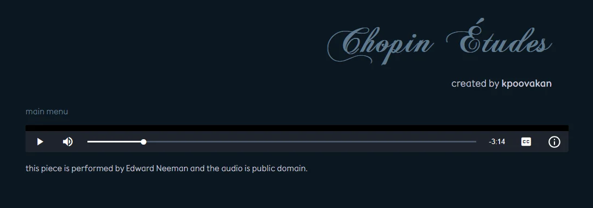

# ChopinEtudes  
  

## Quick Description
Listen to all 27 of Chopin's études with ChopinEtudes! This music player is a web app and does not require any installation, prerequisites, or dependencies. Simply visit ChopinEtudes [here](https://kpoovakan.github.io/chopinetudes).  

## What's an _étude_?
Good question! In classical piano, there are many different types of piano pieces, like a sonata, concerto, or an étude. The word "étude" means "study", so many composers wrote études to be fancy ways to practice piano. Many of Chopin's études are so hard to play that they are used as concert pieces or music to listen to, not just for practicing piano!

## Who's Chopin?
Chopin (pronounced "show-pan", not "chop-ehn") was a composer of the 1800s. He wrote over 230 prestigious piano pieces, mostly for solo piano. 27 of his piano pieces were [études](#whats-an-étude), most of which are categorized (by the RCM) as ARCT. Learn more about Chopin and all this ARCT stuff [here](https://kpoovakan.github.io/chopinetudes/#about-chopin).

## Credits
* All code has been created by [kpoovakan](https://kpoovakan.github.io).
* All musical assets are from Wikimedia Commons; we are not affiliated with Wikimedia Commons. Unless otherwise stated, all musical assets are public domain.
* Favicon (music note) icon created by Newbzy. <small>[source](https://commons.wikimedia.org/wiki/File:Music_note.svg)</small>
* The heading font used in this web app was [Chopin Script](https://www.1001fonts.com/chopin-script-font.html) (very fitting!) Its license and copyright is owned by someone else and is not part of ChopinEtude's public domain Unlicense.
* The main font used in this web app was [Cause](https://github.com/xconsau/Cause).
* The base page icons for the buttons used to organize etudes by opus was created by Google. <small>[source](https://commons.wikimedia.org/wiki/File:Android_Emoji_1f4c3.svg)</small>

## Licensing
ChopinEtudes is "licensed" as public domain. The license includes all code specific to ChopinEtudes and all musical assets specified as public domain. All other assets are licensed and/or copyrighted by their original authors and are not included under ChopinEtudes's public domain license. This includes fonts, may include images, and includes some musical assets. For more information, see LICENSE.md for details.